# How to Access Assignments that use GitHub

Several courses in the Department of Computer Science, University of Cyprus distribute their assignments through GitHub. Follow the steps below to set up your account and get your own copy of an assignment repository.

---

## STEP 1: Create GitHub account

You need a GitHub account with your university email address added and verified.

### If you do not have a GitHub account

1. Create an account at [github.com/signup](https://github.com/signup).
2. Use your university email address (`<username>@ucy.ac.cy`) when creating the account.
3. Verify the address by following the instructions in the email GitHub sends you.

### If you already have a GitHub account

1. Sign in to GitHub.
2. Select your profile picture in the top-right corner.
3. Select **Settings**.
4. In the menu on the left, select **Emails**.
5. Under **Add email address**, enter your university email address and select **Add**.
6. Open the verification email sent to that address and follow the verification link.

---

## STEP 2: Join the Organization cs-department-ucy in GitHub

For your first GitHub-based assignment, your tutor will email you an invitation to join the `cs-department-ucy` organization. The invitation looks like Figure 1.

<p align="center">
  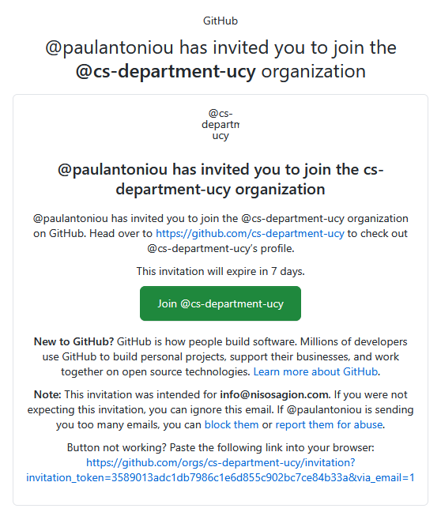<br>
  <em><b>Figure 1.</b> Email invitation to join the <code>cs-department-ucy</code> GitHub organization.</em>
</p>

Click the green button to accept. You are then taken to the profile page of the organization, shown in Figure 2.

<p align="center">
  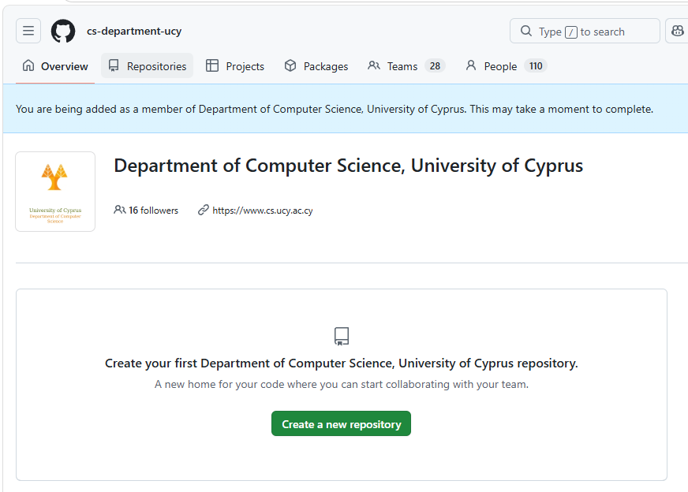<br>
  <em><b>Figure 2.</b> Profile page of the <code>cs-department-ucy</code> organization after accepting the invitation.</em>
</p>

You should **never** try to create repositories inside this organization. So you can safely close this page. All assignment work starts from the Classroom50 platform (see next step).

> Classroom50 is a free, open-source platform for distributing, managing, and grading programming assignments via GitHub.

---

## STEP 3: Sign in to Classroom50

Go to [Classroom50.org](https://classroom50.org) and sign in with your GitHub account (Figure 3).

<p align="center">
  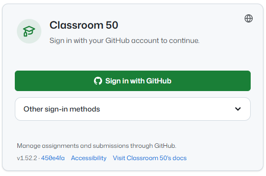<br>
  <em><b>Figure 3.</b> Signing in to Classroom50 with your GitHub account.</em>
</p>

---

## STEP 4: View classrooms in Classroom50

After signing in, you see the profile of the Department of Computer Science, University of Cyprus. Click **Open** to list every course that manages its assignments through GitHub (Figure 4).

<p align="center">
  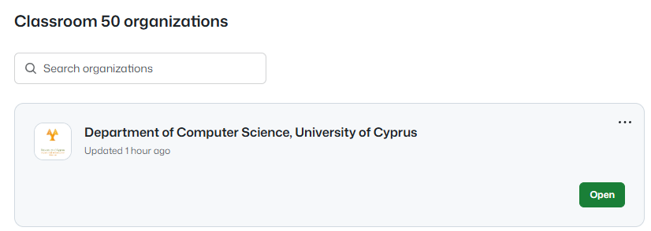<br>
  <em><b>Figure 4.</b> Classroom50 organizations list — click <b>Open</b> on “Department of Computer Science, University of Cyprus”.</em>
</p>

Each course appears as a separate classroom (Figure 5). Select **View assignments** on a classroom to see its assignments.

<p align="center">
  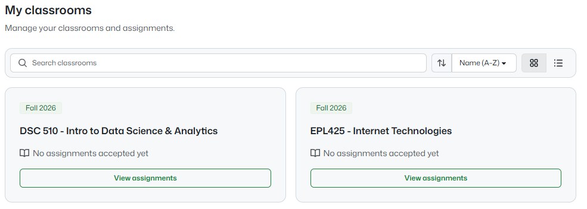<br>
  <em><b>Figure 5.</b> The “My classrooms” page, with one classroom per course.</em>
</p>

Every assignment is listed with its type, due date and current status. To start working on one, you must first **Accept** it (Figure 6). Assignments are either individual or group based.

<p align="center">
  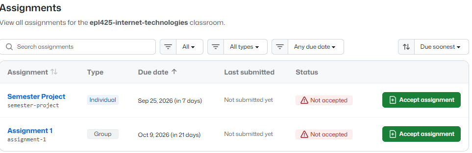<br>
  <em><b>Figure 6.</b> Assignments of a classroom, showing type (Individual/Group), due date, status and the <b>Accept assignment</b> button.</em>
</p>

---

## STEP 5: Accept assignment and clone repository

Individual assignments are carried out by one student; group (team) assignments are carried out by two or more students.

### Working with Individual Assignments

Click **Accept assignment**. A new window opens where you confirm acceptance, and GitHub then creates your personal copy of the assignment repository (Figures 7 and 8).

<p align="center">
  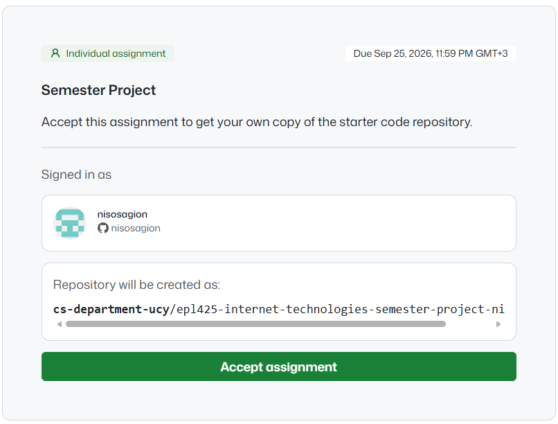<br>
  <em><b>Figure 7.</b> Accepting an individual assignment.</em>
</p>

<p align="center">
  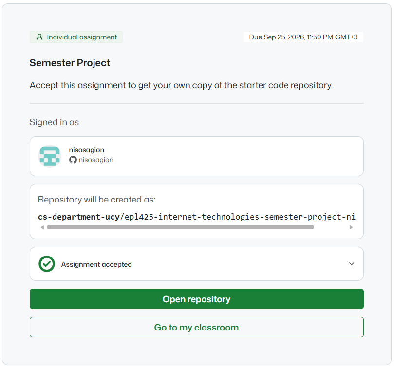<br>
  <em><b>Figure 8.</b> Your personal assignment repository is being created.</em>
</p>

Once the repository is ready, open it (Figure 9).

<p align="center">
  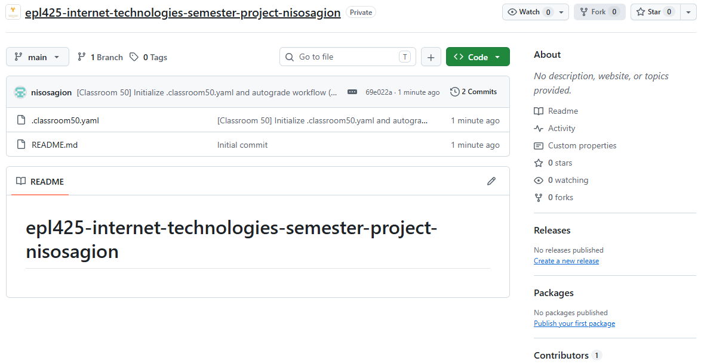<br>
  <em><b>Figure 9.</b> The personal assignment repository on GitHub, containing the starter files.</em>
</p>

To clone the repository, first copy its URL from the green **Code** button (Figure 10).

<p align="center">
  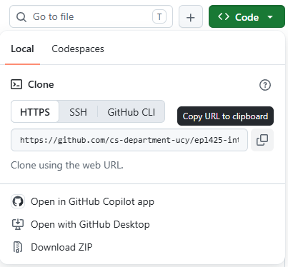<br>
  <em><b>Figure 10.</b> Copying the repository URL from the green <b>Code</b> button.</em>
</p>

Then open VSCode, select the **Explorer** icon at the top left of the window and click **Clone Repository** (Figure 11).

<p align="center">
  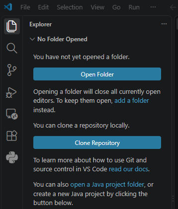<br>
  <em><b>Figure 11.</b> The <b>Clone Repository</b> option in the VSCode Explorer view.</em>
</p>

Paste the repository URL in the input box at the top of the VSCode window to start cloning (downloading) the repository to your computer (Figure 12).

<p align="center">
  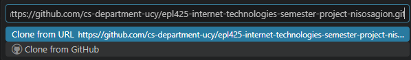<br>
  <em><b>Figure 12.</b> Pasting the repository URL in the VSCode command input.</em>
</p>

Before your first commit, you must identify yourself to Git. From the VSCode menu, select **Terminal → New Terminal** (Figure 13).

<p align="center">
  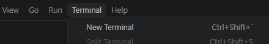<br>
  <em><b>Figure 13.</b> Opening a new terminal in VSCode.</em>
</p>

In the terminal that opens at the bottom of the window, run the following two commands, one at a time:

```bash
git config --global user.name "Your Name"
git config --global user.email your.email@example.com
```

Replace `Your Name` and `your.email@example.com` with your real name and email address. You only need to do this once per computer.

### Working with Group Assignments

For group assignments, clicking **Accept assignment** takes you to a window where you either create a team or join an existing one (Figure 14).

- The first member of the team to accept the assignment creates the team and gives it a short, meaningful name.
- The remaining members accept the assignment and then join that same team. Agree on the team name in advance so everyone joins the correct team.

<p align="center">
  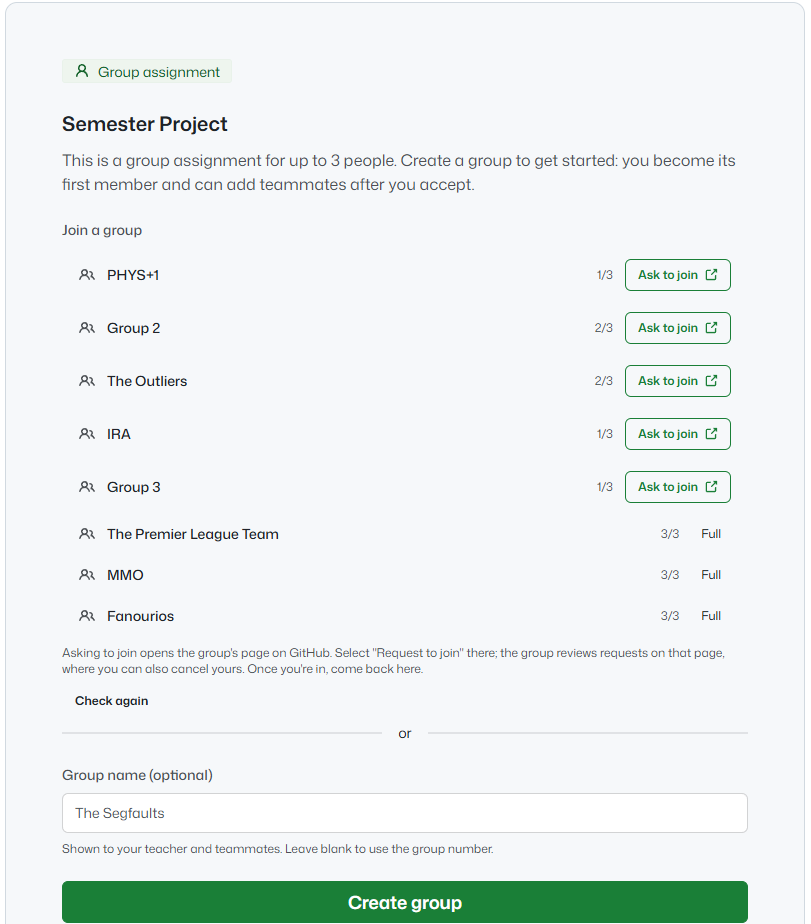<br>
  <em><b>Figure 14.</b> Creating a new team or joining an existing one for a group assignment.</em>
</p>

Once your team is set, confirm acceptance of the assignment (Figure 15).

<p align="center">
  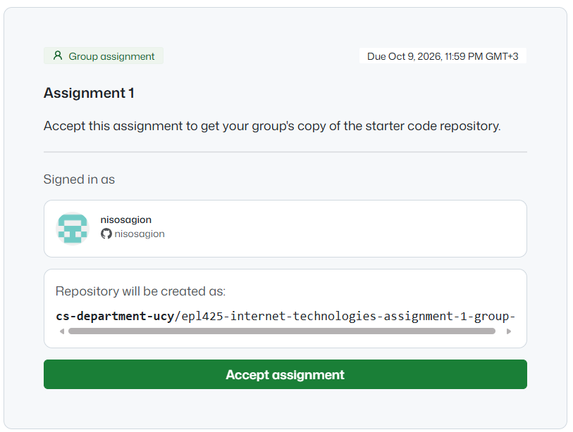<br>
  <em><b>Figure 15.</b> Accepting the group assignment after the team is set.</em>
</p>

When the shared repository is ready, you can open it (Figure 16). The member who created the team also manages it, approving other students who ask to join.

<p align="center">
  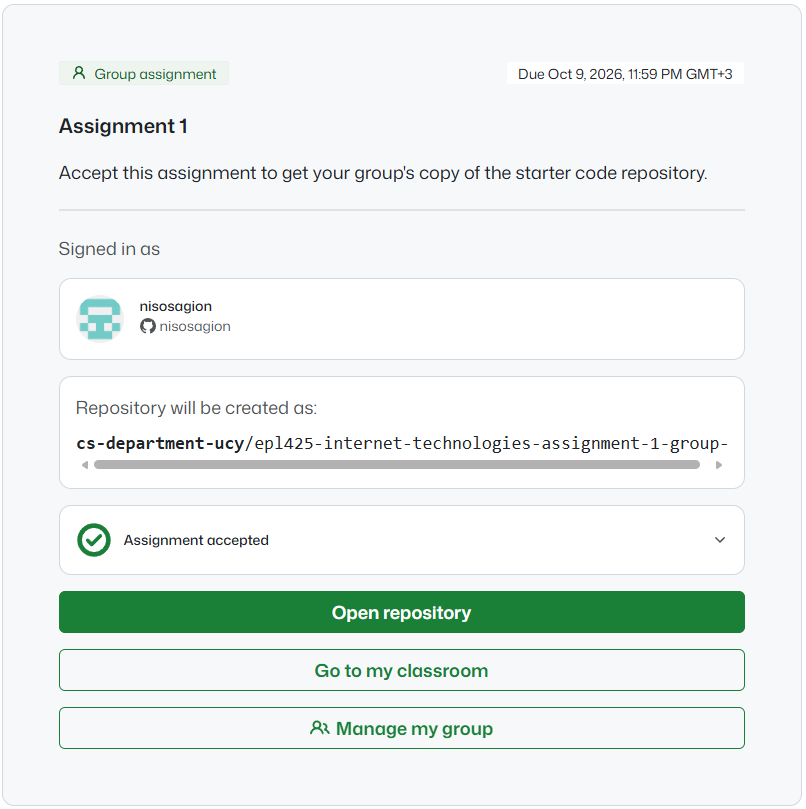<br>
  <em><b>Figure 16.</b> The team repository is ready; the team creator can also manage join requests.</em>
</p>

From here on, cloning the team repository in VSCode follows exactly the same steps as for an individual assignment (Figures 8–13).
